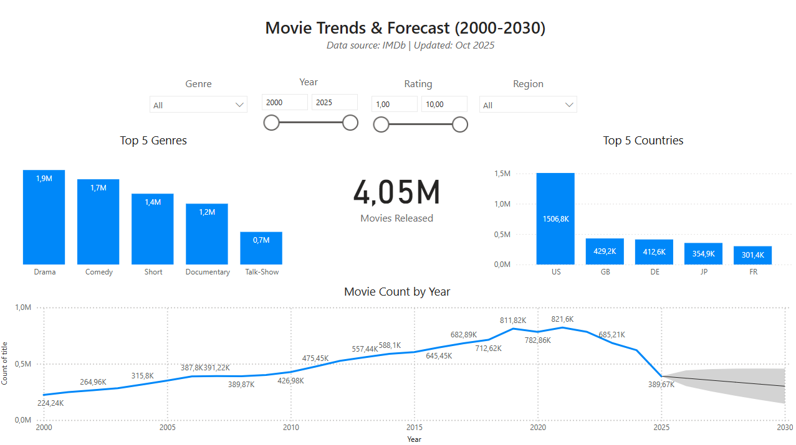

# imdb-movie-trends-forecast-2000-2030
Interactive Power BI dashboard exploring movie production trends (2000–2024) using IMDb data, with genre forecasts up to 2030.

## 📊 Project Overview
This Power BI dashboard explores movie trends from **2000 to 2024**, using data sourced from the **IMDb open dataset**.  
It visualizes key insights about genres, release patterns, ratings, and production dynamics — and includes a **2025–2030 forecast** for each movie genre.

## 🧠 Objectives
- Analyze how movie production evolved across years and genres.  
- Identify which genres gained or lost popularity.  
- Forecast future trends in the film industry based on historical data.  

## 📁 Data Source
The data was taken from the **IMDb official dataset**, freely available for non-commercial use:  
🔗 [https://www.imdb.com/interfaces/](https://datasets.imdbws.com/)

## 🛠️ Tools & Technologies  
- **Power Query** — data transformation and calculated metrics
- **Power BI** — visualization & forecasting

## 📈 Dashboard Highlights
- Interactive visuals by **year, genre, region and rating**  
- Trend analysis across multiple decades  
- Genre-based **forecasting model (2025–2030)**
  
## 💡 Key Insights
- Movie releases peaked in the first quarter of 2019 and again in the first quarter of 2021, showing clear seasonal production trends.  
- Strong growth in film production from 2000 to 2019, followed by a sharp decline in 2020–2021 due to COVID-19.
- **Top Countries:** USA, UK, Germany, Japan, France — with the USA accounting for the majority of global output.
- Drama remains the dominant genre, showing consistent popularity over two decades.

Check out my dashboard here:
[View Dashboard](https://drive.google.com/file/d/182aHn_pwb2lJwIB7UrZE_V0O50oVEdb1/view?usp=sharing)

